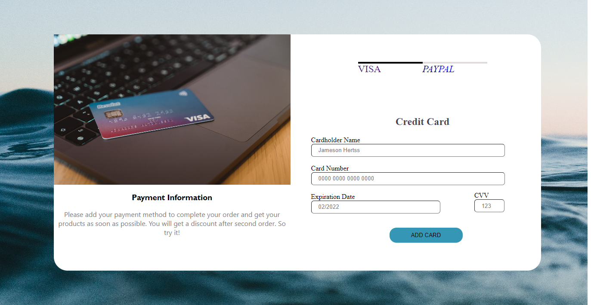

This a credit card checkout webpage to test my understanding on HTML and CSS

## Table of contents

- [Overview](#overview)
  - [Screenshot](#screenshot)
  - [Links](#links)
- [My process](#my-process)
  - [Built with](#built-with)
- [Author](#author)

## Overview

### The challenge

Users should be able to:

- View the optimal layout for the site depending on their device's screen size

### Screenshot

;
;

### Links
- Live Site URL: [View Live Site](https://Mhirex.github.io/CreditCard-Checkout/)

## My process

### Built with

- Semantic HTML5 markup
- CSS custom properties
- Flexbox

## Author
- Twitter - [@Mhirex_](https://www.twitter.com/Mhirex_)

